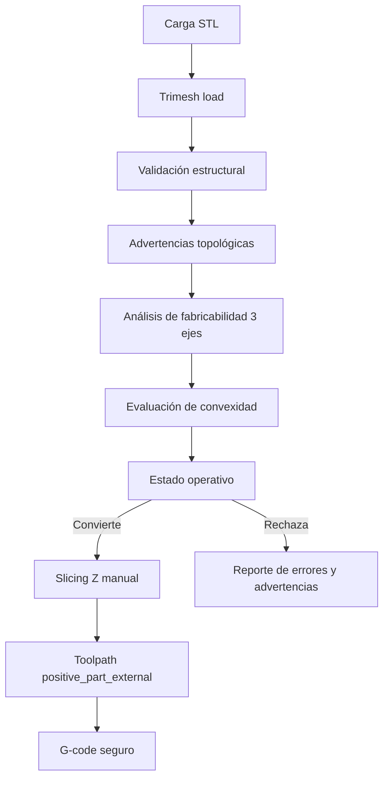

# Arquitectura

G-Coder V2 separa la interfaz visual del motor geométrico. La organización del repositorio busca que la tesis pueda defenderse por capas: UI, comunicación API, dominio G-Coder y algoritmos geométricos backend.

## Estructura General

- **Frontend (`frontend/`)**: Next.js, React 19, TypeScript, Tailwind, shadcn/ui y Three.js. Gestiona carga de STL, vista 3D, parámetros CNC, reporte y descarga `.nc`.
- **Backend (`backend/`)**: FastAPI con Trimesh, NumPy y Shapely. Es la fuente principal para validación, análisis de compatibilidad con CNC router de 3 ejes, slicing, trayectorias y G-code básico.
- **Documentación (`docs/`)**: notas de arquitectura, alcance y soporte académico para la tesis.

## Frontend

El frontend mantiene `app/` como entrada estándar de Next.js y concentra el dominio de tesis en `src/features/gcoder`.

```text
frontend/
  app/
  src/
    features/gcoder/
      api/
      components/
      hooks/
      legacy/
      types/
      utils/
    components/ui/
    components/layout/
    hooks/
    lib/
    types/
```

- `src/features/gcoder/api`: cliente HTTP hacia FastAPI. No contiene lógica geométrica principal; envía la transformación visual seleccionada como metadata JSON.
- `src/features/gcoder/components`: componentes específicos del flujo STL, visor, análisis, parámetros y G-code.
- `src/features/gcoder/hooks`: estado de la experiencia G-Coder.
- `src/features/gcoder/types`: contratos TypeScript para análisis, mecanizado y G-code.
- `src/features/gcoder/legacy`: lógica histórica de análisis en navegador. Se conserva solo como comparación temporal mientras el backend sigue siendo la fuente principal.
- `src/components/ui`: componentes genéricos shadcn/ui.
- `src/lib`: utilidades transversales como `cn`, constantes y lectura de entorno.

Esta separación evita mezclar componentes visuales genéricos con lógica específica de la tesis.

## Backend

```text
backend/app/
  routers/
  schemas/
  services/
  core/
```

- `routers`: reciben requests y devuelven responses.
- `schemas`: contratos Pydantic.
- `services`: coordinan el flujo de análisis o conversión.
- `core`: algoritmos geométricos y CAM básico, incluyendo aplicación de transformaciones de modelo.

El endpoint `POST /api/analyze` es la etapa principal previa a cualquier conversión. El backend es la fuente de verdad para decidir si un STL parece compatible con mecanizado CNC router de 3 ejes bajo reglas simplificadas.

## Flujo STL a G-code

1. El usuario carga un STL en la UI.
2. `POST /api/analyze` lee la malla con Trimesh, aplica rotación/escala si se enviaron, normaliza a coordenadas CNC, valida integridad básica y calcula una heurística de compatibilidad con mecanizado CNC router de 3 ejes.
3. Si el modelo parece compatible, el usuario configura parámetros de mecanizado.
4. `POST /api/convert` ejecuta:
   - aplicación de transformaciones del modelo,
   - normalización a coordenadas CNC,
   - validación de malla,
   - análisis de fabricabilidad vertical,
   - slicing manual por planos Z mediante intersección triángulo-plano,
   - generación básica de trayectorias con la estrategia principal `positive_part_external`,
   - postprocesado a G-code,
   - cálculo del stock virtual usado por el algoritmo y del stock físico recomendado,
   - reporte de métricas.



## Alcance

El MVP actual está diseñado solo para modelos STL compatibles con mecanizado CNC router de 3 ejes. Acepta geometrías convexas y también concavidades accesibles verticalmente si no hay socavados evidentes.

OBJ y PLY quedan como mejora futura de soporte de mallas. STEP e IGES quedan fuera del MVP porque requieren un pipeline CAD/B-Rep diferente.

No es un CAM industrial: no implementa simulación completa de remoción de material, detección perfecta de colisiones, selección automática avanzada de herramienta/material, optimización industrial ni mecanizado de 4 o 5 ejes.

La validación física planteada para la tesis se limita a una CNC router objetivo con controlador DSP. El sistema genera G-code estándar para 3 ejes, pero no implementa perfiles múltiples de máquina ni promete compatibilidad universal con todos los DSP. La herramienta experimental estándar por defecto es una fresa cilíndrica/end mill de `3.000 mm`.

## Slicing Z

Trimesh se usa para cargar y representar la malla STL. El slicing del backend no usa directamente `mesh.section(...)`; está implementado en `backend/app/core/slicer.py` mediante intersección manual de los triángulos de `mesh.triangles` contra planos horizontales en Z. El sistema calcula `minZ` y `maxZ` desde `mesh.bounds`, genera niveles desde `maxZ - step_down_mm` hacia niveles inferiores, proyecta los puntos de intersección a XY y reconstruye contornos 2D con Shapely (`LineString`, `polygonize`, `unary_union`).

La reconstrucción de capas conserva la jerarquía geométrica: exteriores, interiores y múltiples polígonos. Las capas internas mantienen una geometría Shapely (`Polygon`/`MultiPolygon`) además de metadatos serializables (`has_holes`, `hole_count`, `polygon_count`, `geometry_repair_used`, `lost_holes_detected`). Esto evita que un hueco interno de una letra “O”, arandela o marco rectangular se convierta en un contorno sólido.

Si una sección no cierra correctamente, se registra una advertencia. El slicer puede usar `convex_hull` como último recurso, pero no lo hace silenciosamente: la conversión reporta `convex_hull_fallback_used`, `slicing_fallback_used` y `geometry_preservation_warning`. Si el proceso implica pérdida de huecos internos, el reporte marca `lost_holes_detected` y agrega advertencias de preservación geométrica.

## Toolpath de Pieza Positiva

La estrategia principal para tesis es `positive_part_external`. En esta estrategia, el STL representa la pieza positiva a conservar, el stock representa el bloque inicial de material y las trayectorias se generan sobre el material externo sobrante. Aunque el código no guarda necesariamente una variable llamada `removal_area`, implementa la lógica equivalente mediante el área permitida para el centro de la herramienta:

```text
tool_radius = tool_diameter_mm / 2
piece_keepout = piece_polygon.buffer(tool_radius)
stock_inside = stock_polygon.buffer(-tool_radius)
tool_center_allowed_area = stock_inside - piece_keepout
```

El objetivo es evitar que el centro de la fresa invada el contorno protegido de la pieza. Las estrategias históricas `contour`, `zigzag` y `contour_parallel` se mantienen por compatibilidad y se reportan como `legacy_internal_pocket`, no como estrategia principal de tesis.

Cuando `piece_polygon` contiene huecos internos, esos interiores no se aplanan ni se convierten en sólidos. La diferencia contra el stock deja también el material del hueco como zona removible si el radio de herramienta puede entrar. Los huecos menores al diámetro de herramienta generan advertencias como `HOLE_TOO_SMALL_FOR_TOOL` y reducen `hole_preservation_rate`; no se rellenan silenciosamente.

## Stock y Preparación Física

El stock de algoritmo se calcula con la fórmula real usada por `positive_part_external`, basada en el bounding box del STL ya transformado y normalizado:

```text
algorithm_stock_x = model_x + 2 * stock_margin_mm
algorithm_stock_y = model_y + 2 * stock_margin_mm
algorithm_stock_z = model_z
```

Este stock representa el bloque virtual usado para calcular el área externa removible. No modifica el STL y no debe confundirse con una orden de preparación física exacta.

Para trazabilidad de validación en máquina, `/api/convert` también reporta un stock físico recomendado:

```text
recommended_margin_xy = max(3 * tool_diameter_mm, 10.0)
recommended_extra_z = 3.0
recommended_physical_stock_x = model_x + 2 * recommended_margin_xy
recommended_physical_stock_y = model_y + 2 * recommended_margin_xy
recommended_physical_stock_z = model_z + recommended_extra_z
```

Los campos expuestos son `model_dimensions_mm`, `algorithm_stock_mm`, `recommended_physical_stock_mm`, `stock_margin_xy_mm`, `recommended_margin_xy_mm`, `recommended_extra_z_mm`, `tool_diameter_mm`, `tool_radius_mm`, `work_origin_assumption`, `z_zero_assumption` y `stock_notes`. El G-code no incluye comentarios; esos datos se exponen en JSON y en la UI para no comprometer compatibilidad con simuladores o controladores.

La herramienta estándar en esta etapa es una fresa cilíndrica/end mill de `3.000 mm` con diámetro parametrizado. No hay perfiles múltiples CNC, selección automática de herramientas ni tabs automáticos. Si la pieza debe separarse completamente del stock, se requiere fijación externa o tabs manuales.

Cuando `min(model_x, model_y)` es pequeño frente al diámetro configurado, la conversión agrega advertencias como `MODEL_SMALL_RELATIVE_TO_TOOL`, `TOOL_LARGE_RELATIVE_TO_MODEL` y `FINE_DETAILS_MAY_BE_LOST`. El objetivo es avisar que los detalles finos pueden perder fidelidad por compensación del radio de herramienta; no es un bloqueo ni un error geométrico.

## Métrica de precisión 2.5D

La conversión calcula una métrica dimensional aproximada basada en capas. Para cada capa comparable se muestrean puntos sobre los boundaries de la geometría objetivo, incluyendo exteriores e interiores, y se mide su distancia contra los boundaries de una geometría nominal compensada por radio de herramienta. También se compara área de capa y preservación de huecos.

Campos principales del reporte:

- `rmse_mm`
- `mean_error_mm`
- `max_error_mm`
- `area_error_percent`
- `compared_layers`
- `skipped_layers`
- `hole_preservation_rate`
- `total_holes_detected`
- `total_holes_preserved`
- `layer_geometry_warnings`

Esta métrica no simula remoción física completa ni colisiones; sirve como estimación geométrica reproducible para resultados de tesis. `rmse_mm` solo queda en `null` si no hay geometrías de capa comparables.

## Heurísticas de Fabricabilidad

La fabricabilidad no es una simulación CAM industrial. El backend usa reglas geométricas simplificadas: convexidad aproximada, área de superficies descendentes fuera de la base, muestreo vertical por columnas y puntaje de accesibilidad. Los umbrales actuales son:

- `convexity_ratio >= 0.98`: geometría probablemente convexa.
- `accessibility_score >= 0.7`: geometría probablemente accesible desde Z.
- `underside_area_ratio > 0.02`: riesgo de socavado.
- `complex_ratio > 0.08`: riesgo geométrico por múltiples intersecciones verticales.

Las mallas vacías, sin caras, sin vértices o con dimensiones inválidas se clasifican como `NO_APTO_MALLA_INVALIDA`. Una malla no watertight o con winding inconsistente genera advertencias topológicas; no bloquea siempre la conversión si la geometría sigue siendo procesable.

## Convención CNC

- Unidades: milímetros.
- Modo: coordenadas absolutas.
- Control físico de validación: CNC router objetivo con controlador DSP.
- Compatibilidad: G-code estándar de 3 ejes; requiere simulación, revisión del controlador y prueba en aire.
- Ejes de backend: `X` ancho, `Y` profundidad, `Z` altura vertical de mecanizado.
- `Z=0`: superficie superior del stock/modelo.
- Corte: valores Z negativos.
- `safe_z_mm`: altura positiva para traslados rápidos.
- Origen inicial recomendado: `bottom_left`, con margen XY.
- Después de aplicar rotación y escala, el backend traslada la malla para que `minZ=0` y evita coordenadas negativas innecesarias en `X/Y`.
- Estrategia actual: capas con `step_down_mm`; no implementa un flujo industrial completo de desbaste/acabado.
- El archivo `.nc` comienza con comandos ejecutables (`G21`, `G90`, `G17`, `G94`, `G54`) y no contiene comentarios.
- En el frontend, una vez generado el G-code, las transformaciones del modelo quedan bloqueadas para evitar inconsistencias entre la geometría analizada y el archivo generado.

## Transformaciones

El frontend no modifica físicamente el STL. El usuario puede rotar y escalar el modelo en la UI; esos valores se envían al backend como `transform` en `multipart/form-data`.

```json
{"rotation_x_deg":0,"rotation_y_deg":0,"rotation_z_deg":90,"scale":1.0}
```

El backend aplica esa transformación antes de validar, analizar, slicear y generar G-code. La orientación forma parte del estado de fabricabilidad porque cambia qué superficies son accesibles desde el eje vertical `Z` en una operación CNC router de 3 ejes.
