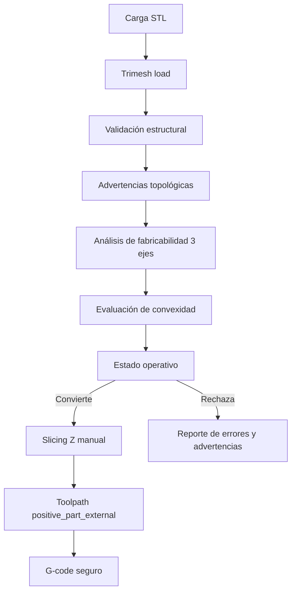

# Notas Para Tesis

## Problema

El sistema aborda la conversión automática de modelos 3D en formato STL a G-code para máquinas CNC router de 3 ejes, dentro de un alcance académico y experimental.

## Qué resuelve

El módulo backend de análisis permite cargar un STL, validar propiedades básicas de la malla y estimar si la geometría parece compatible con mecanizado CNC router de 3 ejes mediante una aproximación vertical. Esta etapa antecede a cualquier generación de G-code porque una trayectoria sobre una malla inválida o una geometría con socavados puede producir resultados inseguros o técnicamente indefendibles.

## Qué no resuelve

No reemplaza un CAM industrial. No garantiza mecanizar cualquier STL. No realiza optimización avanzada, simulación física completa, detección perfecta de colisiones ni selección automática ideal de herramienta/material. Tampoco implementa mecanizado de 4 o 5 ejes, perfiles múltiples de CNC, compatibilidad universal con controladores DSP ni tabs automáticos.

La herramienta experimental estándar por defecto para las pruebas de tesis es una fresa cilíndrica/end mill de `3.000 mm`. El usuario puede cambiar `tool_diameter_mm` para ensayos puntuales, pero el flujo base de validación usa radio de herramienta `1.500 mm`.

## Fabricabilidad

“Fabricable” en este prototipo significa que el modelo parece compatible con una herramienta vertical de 3 ejes bajo reglas simplificadas. El análisis acepta concavidades accesibles desde Z, pero marca como riesgo los socavados, superficies ocultas o múltiples intersecciones verticales complejas.

La fabricabilidad se evalúa como heurística geométrica, no como garantía CAM industrial. Los umbrales operativos actuales son:

- `convexity_ratio >= 0.98`: el modelo se considera probablemente convexo.
- `accessibility_score >= 0.7`: la geometría se considera probablemente accesible desde Z.
- `underside_area_ratio > 0.02`: se marca riesgo de socavado.
- `complex_ratio > 0.08`: se marca riesgo geométrico por múltiples intersecciones verticales.

Las mallas vacías, sin caras, sin vértices o con dimensiones inválidas se clasifican como `NO_APTO_MALLA_INVALIDA`. Las mallas no watertight o con winding inconsistente generan advertencias topológicas y pueden continuar si no existen errores estructurales graves y la geometría sigue siendo procesable.

## Arquitectura del sistema desarrollado

El sistema se organiza como una aplicación web por capas. El frontend, construido con Next.js y React, cumple el rol de interfaz de interacción: carga de archivos STL, visualización 3D, configuración de parámetros y presentación de resultados. La lógica específica de la tesis se concentra en `features/gcoder`, separando componentes visuales, hooks, cliente API, tipos y utilidades.

El backend, construido con FastAPI, cumple el rol de motor de análisis geométrico. Sus routers exponen endpoints, los servicios coordinan el flujo y el núcleo geométrico usa Trimesh y NumPy para validar mallas y estimar compatibilidad con mecanizado CNC router de 3 ejes.

El endpoint `/api/analyze` representa la etapa previa a la conversión STL a G-code. Esta separación permite probar el análisis de forma aislada, comparar casos de estudio y documentar resultados sin depender de la interfaz visual. Metodológicamente, facilita repetir experimentos y justificar por qué un modelo es aceptado con advertencias, rechazado por malla inválida o marcado como no compatible por geometría.

La orientación del modelo se considera parte del problema de fabricabilidad. En CNC router de 3 ejes el eje `Z` es la dirección vertical de mecanizado; por lo tanto, rotar la pieza puede cambiar qué caras son accesibles, si existe una base adecuada y si aparecen posibles socavados.



## Endpoint `/api/analyze`

El endpoint `POST /api/analyze` recibe archivos STL ASCII o binarios mediante `multipart/form-data`. Devuelve métricas geométricas, validación de malla, advertencias, errores, tiempo de procesamiento y un estado clasificable:

- `APTO_PARA_CONVERSION`: malla válida y geometría aparentemente compatible.
- `APTO_CON_ADVERTENCIAS`: malla analizable, pero con advertencias que deben revisarse.
- `NO_APTO_MALLA_INVALIDA`: errores graves de malla.
- `NO_APTO_POR_GEOMETRIA`: posibles socavados o geometría no compatible con la aproximación vertical.

La heurística usa propiedades de Trimesh, volumen aproximado, convex hull, normales, bounding box y muestreo vertical simplificado. No equivale a una simulación CAM completa ni garantiza fabricación física.

El endpoint acepta opcionalmente un campo `transform` como JSON. El backend aplica escala uniforme y rotaciones X/Y/Z en grados antes de validar la malla. Luego normaliza la geometría a coordenadas CNC: `X` ancho, `Y` profundidad, `Z` altura vertical, con `minZ=0`. La respuesta incluye `transformApplied` y las dimensiones corresponden al modelo transformado.

## Métricas

El reporte de conversión incluye tiempo de procesamiento, número de capas, movimientos de herramienta, líneas de G-code, longitud estimada de trayectoria, límites XYZ, warnings y anomalías. Además calcula una métrica dimensional aproximada 2.5D por capas: `rmse_mm`, `mean_error_mm`, `max_error_mm`, `area_error_percent`, `compared_layers`, `skipped_layers` y `hole_preservation_rate`. La métrica compara contornos objetivo contra geometría nominal compensada por radio de herramienta; no representa una simulación física completa de remoción.

Para apoyar la validación física controlada, el reporte también expone dimensiones del modelo y stock: `model_dimensions_mm`, `algorithm_stock_mm`, `recommended_physical_stock_mm`, `stock_margin_xy_mm`, `recommended_margin_xy_mm`, `recommended_extra_z_mm`, `tool_diameter_mm`, `tool_radius_mm`, `work_origin_assumption`, `z_zero_assumption` y `stock_notes`.

## Slicing en Z

Trimesh se usa para cargar y representar la malla STL, pero el rebanado no usa directamente `mesh.section(...)`. El backend implementa el slicing en `backend/app/core/slicer.py` mediante intersección manual triángulo-plano.

El flujo real es:

1. `slice_mesh` obtiene `min_z` y `max_z` desde `mesh.bounds`.
2. `_slice_levels` genera niveles desde `max_z - step_down_mm` hacia niveles inferiores.
3. `_triangle_plane_segment` intersecta cada triángulo de `mesh.triangles` contra un plano horizontal en Z.
4. Los puntos de intersección se proyectan a XY.
5. `_contours_at_z` reconstruye contornos 2D usando Shapely (`LineString`, `polygonize`, `unary_union`).

Matemáticamente, el corte equivale a planos horizontales con normal Z, aunque el código no declare una variable explícita `plane_normal = [0, 0, 1]`.

Si la reconstrucción de contornos falla, el slicer puede intentar un fallback. El uso de `convex_hull` existe solo como último recurso y queda reportado mediante `convex_hull_fallback_used`, `slicing_fallback_used` y `geometry_preservation_warning`; no debe interpretarse como preservación estricta de geometría. Las capas conservan `Polygon`/`MultiPolygon` con interiores para no rellenar huecos internos verticales, como arandelas, marcos o letras tipo “O”.

## Semántica de mecanizado de pieza positiva

En la estrategia principal `positive_part_external`, el STL representa la pieza objetivo que debe conservarse. El backend construye un stock rectangular a partir del bounding box de la pieza expandido por `stock_margin_mm`; el área de remoción se interpreta como `stock - pieza`. Para compensar la herramienta, el centro de corte se limita a la zona externa al contorno protegido de la pieza, evitando trayectorias dentro del volumen que se desea conservar.

La implementación no depende necesariamente de una variable llamada `removal_area`; usa el área permitida para el centro de la herramienta:

```text
tool_radius = tool_diameter_mm / 2
piece_keepout = piece_polygon.buffer(tool_radius)
stock_inside = stock_polygon.buffer(-tool_radius)
tool_center_allowed_area = stock_inside - piece_keepout
```

Las estrategias históricas `contour`, `zigzag` y `contour_parallel` se conservan como compatibilidad de pocket interno y se reportan como `legacy_internal_pocket`. No son la estrategia principal defendible para la tesis.

El slicer no debe convertir silenciosamente un contorno cóncavo en una envolvente convexa ni rellenar huecos internos. Si se usa `convex_hull` como último recurso, el reporte marca `convex_hull_fallback_used`, `slicing_fallback_used` y `geometry_preservation_warning`, además de registrar una anomalía. Las concavidades y huecos accesibles verticalmente pueden convertirse con advertencias; si el diámetro de herramienta puede perder detalle o no puede entrar en un hueco, el reporte marca `detail_loss_risk`, `HOLE_TOO_SMALL_FOR_TOOL` o `HOLE_PRESERVATION_INCOMPLETE` y recomienda reducir `tool_diameter_mm`.

## Stock para validación física

El stock del algoritmo corresponde al bloque virtual usado para generar las trayectorias externas. Conserva el comportamiento de la estrategia actual:

```text
algorithm_stock_x = model_x + 2 * stock_margin_mm
algorithm_stock_y = model_y + 2 * stock_margin_mm
algorithm_stock_z = model_z
```

Como la validación física se realizará en una CNC router objetivo con controlador DSP, el sistema reporta además una recomendación de stock físico con margen más conservador:

```text
recommended_margin_xy = max(3 * tool_diameter_mm, 10.0)
recommended_extra_z = 3.0
recommended_physical_stock_x = model_x + 2 * recommended_margin_xy
recommended_physical_stock_y = model_y + 2 * recommended_margin_xy
recommended_physical_stock_z = model_z + recommended_extra_z
```

Esta recomendación no reemplaza una planificación CAM industrial. Sirve para que el operador prepare material mayor que el STL, verifique fijación, simule el archivo y realice una prueba en aire antes del mecanizado real. La herramienta estándar considerada es una fresa cilíndrica/end mill definida por diámetro; no se implementan múltiples tipos de herramienta. Si se busca liberar totalmente la pieza, se deben usar fijación externa o tabs manuales, porque esta versión no genera tabs automáticos.

La respuesta JSON y el frontend muestran la información de stock, herramienta y origen. El archivo `.nc` no la incluye como comentario para mejorar compatibilidad con simuladores y controladores.

## Parámetros de corte y G-code

El usuario configura desde el frontend los parámetros principales de mecanizado:

- `tool_diameter_mm`: diámetro de herramienta; define el radio usado en compensación.
- `step_down_mm`: profundidad por pasada; controla los niveles Z del slicing.
- `step_over_mm`: separación lateral entre pasadas.
- `feed_rate_mm_min`: avance lateral; se emite como `F` en movimientos `G1` XY.
- `plunge_rate_mm_min`: avance vertical; se emite como `F` al bajar en Z.
- `spindle_rpm`: velocidad del husillo; se emite como `M3 S...`.
- `safe_z_mm`: altura segura para movimientos rápidos.
- `stock_margin_mm`: margen externo del stock alrededor de la pieza.
- `strategy`: estrategia de toolpath.
- `origin`: origen de coordenadas.

`tolerance_mm` existe en backend y en los tipos/defaults del frontend, pero no se expone como campo editable principal. `units` existe como enum fijo en milímetros y se materializa en el G-code mediante `G21`.

El G-code generado no contiene comentarios con `;` ni comentarios entre paréntesis. El archivo comienza directamente con el bloque modal estándar:

```gcode
G21
G90
G17
G94
G54
G0 Z{safe_z_mm}
M3 S{spindle_rpm}
```

Significado:

- `G21`: unidades en milímetros.
- `G90`: coordenadas absolutas.
- `G17`: plano XY.
- `G94`: avance en unidades por minuto.
- `G54`: sistema de coordenadas de trabajo.
- `G0 Z{safe_z_mm}`: subida a altura segura.
- `M3 S{spindle_rpm}`: encendido del spindle con RPM configuradas.

El footer actual es:

```gcode
G0 Z{safe_z_mm}
M5
M30
```

`M5` apaga el spindle y `M30` finaliza el programa. Además, el postprocesador inserta una subida a `safe_z_mm` antes de movimientos rápidos XY si la herramienta está por debajo de la altura segura.

## Estado funcional del prototipo MVP

El prototipo MVP permite cargar archivos STL desde el frontend, enviarlos al backend FastAPI para análisis, validar propiedades básicas de la malla y estimar compatibilidad con mecanizado CNC router de 3 ejes. Si el modelo es válido y compatible, el usuario puede configurar parámetros CNC básicos y solicitar la conversión.

La conversión actual ejecuta slicing básico por capas, genera trayectorias simples, produce G-code con encabezado seguro (`G21`, `G90`, `G17`, `G94`, `G54`), eleva a `safe_z_mm`, enciende el husillo con `M3 S...` y finaliza con `M5` y `M30`. El frontend muestra el G-code, un reporte simple de capas/movimientos/advertencias/anomalías y permite descargar un archivo `.nc`.

Limitaciones: solo se soporta STL; la compatibilidad 3 ejes es heurística; no hay simulación CAM industrial ni detección perfecta de colisiones; el RMSE disponible es una aproximación 2.5D basada en capas y contornos, no una medición física; el G-code debe validarse antes de ejecutarse en una máquina real.

La preparación de stock queda explícita en el reporte y en la UI, no en comentarios dentro del G-code. El sistema no implementa perfiles múltiples CNC ni tabs automáticos; la validación física se plantea para una única CNC objetivo con controlador DSP y debe acompañarse de simulación y prueba en aire.

Una vez generado el G-code, el frontend bloquea rotación, escala y reset de transformaciones para evitar inconsistencias entre la geometría procesada y el archivo `.nc`. Si el usuario necesita modificar el modelo, debe quitar el resultado actual o volver a cargar el STL.

Los modelos muy pequeños frente a la fresa de `3.000 mm` pueden perder detalles finos: dientes pequeños, esquinas estrechas o cavidades cercanas al diámetro de herramienta pueden suavizarse o ensancharse por compensación de radio. La conversión lo reporta como advertencia (`MODEL_SMALL_RELATIVE_TO_TOOL`, `TOOL_LARGE_RELATIVE_TO_MODEL`, `FINE_DETAILS_MAY_BE_LOST`) y no como bug del sistema.

La conversión usa la misma transformación aplicada en el análisis. Si el usuario modifica rotación o escala en el frontend después de analizar, debe reanalizar antes de generar G-code para mantener coherencia entre orientación visual y procesamiento backend.

## Validación inicial del MVP mediante casos STL controlados

Para endurecer el endpoint `/api/convert` se incorporó un conjunto pequeño de casos STL generados por código con Trimesh dentro de la suite de pruebas backend. Este dataset inicial evita depender de archivos externos y permite repetir las pruebas de forma determinística.

Casos incluidos:

- Caja/cubo: sólido cerrado simple, esperado como convertible.
- Prisma rectangular: sólido cerrado con proporciones distintas, esperado como convertible.
- Cilindro simple: sólido facetado cerrado, esperado como convertible.
- Cono simple: sólido cerrado con sección variable, esperado como convertible.
- Semicilindro/D-shape con cara plana en la base: caso orientado para ser más favorable al mecanizado vertical.
- Semicilindro/D-shape con curva hacia la base: caso orientado para evidenciar superficies descendentes y menor accesibilidad.
- Malla plana inválida: triángulos coplanares sin volumen útil, esperada como rechazo por malla inválida.
- Geometría con posible socavado/overhang: composición de volúmenes que genera superficies descendentes fuera de la base, esperada como rechazo por geometría no apta para CNC router de 3 ejes bajo la heurística actual.

Las pruebas verifican conversión exitosa en modelos válidos, rechazo de mallas inválidas, rechazo de geometrías con posible socavado, G-code no vacío, encabezado CNC completo (`G21`, `G90`, `G17`, `G94`, `G54`), footer (`M5`, `M30`) y elevación a `safe_z_mm` antes de movimientos rápidos en XY.

El reporte JSON de conversión queda preparado para uso experimental con campos explícitos: `model_name`, `status`, `layer_count`, `toolpath_move_count`, `gcode_line_count`, `processing_time_seconds`, `warnings`, `anomalies`, `parameters_used`, `rmse_mm`, `max_error_mm`, `mean_error_mm`, `area_error_percent` y `hole_preservation_rate`. La precisión reportada es geométrica 2.5D y reproducible; no afirma precisión física porque no simula la remoción real de material.

El caso semicilindro/D-shape demuestra que la orientación del mismo tipo de pieza cambia el análisis de fabricabilidad: con la cara plana apoyada en `Z=0` la base es clara y el puntaje de accesibilidad es mayor; con la superficie curva orientada hacia la base aparecen superficies descendentes fuera de la zona base y el puntaje de accesibilidad disminuye. Esto justifica aplicar las transformaciones en el backend antes del análisis, porque la orientación visual seleccionada por el usuario forma parte de la posición real de mecanizado.

La detección sigue siendo heurística. El sistema no resuelve colisiones ni simula remoción de material; solo usa señales geométricas simplificadas como planitud de base, normales descendentes, convexidad y muestreo vertical para advertir o rechazar casos potencialmente no aptos.

## Uso en capítulo IV

Para resultados se pueden comparar modelos de prueba por cantidad de triángulos, estado de validación, compatibilidad 3 ejes y tiempo de procesamiento del análisis. También se pueden discutir casos rechazados por socavados o mallas inválidas como evidencia de límites del prototipo.

## Evaluación batch del dataset controlado

Se agregó una evaluación batch automática para ejecutar el flujo real del backend sobre el dataset STL controlado. El script se ejecuta desde `backend` con:

```bash
python scripts/run_batch_evaluation.py
```

El resultado se guarda en `backend/reports/batch_evaluation.json`. El JSON incluye metadata general (`generated_at`, proyecto, alcance, cantidad de modelos), un resumen agregado y una entrada por modelo.

Modelos evaluados:

- `cube.stl`
- `rectangular-prism.stl`
- `cylinder.stl`
- `cone.stl`
- `invalid-flat.stl`
- `overhang.stl`
- `semicylinder_flat_base.stl`
- `semicylinder_curved_base.stl`

Por cada modelo se registran categoría, comportamiento esperado, estado de análisis, validez de malla, compatibilidad CNC router de 3 ejes, convexidad aproximada, posibles socavados, `accessibilityScore`, `baseFlatnessScore`, advertencias, errores, estado de conversión, cantidad de capas, movimientos de herramienta, líneas de G-code, tiempo de procesamiento y parámetros CNC usados.

Este reporte puede usarse como evidencia inicial en la tesis porque permite comparar casos válidos, inválidos y no aptos bajo el mismo pipeline reproducible. Los modelos no aptos no hacen fallar el script; quedan registrados como rechazados o no convertidos junto con el motivo.

Limitaciones: el RMSE calculado es aproximado por capas, no simula remoción física de material, no verifica colisiones reales y no reemplaza un CAM industrial. La evaluación mide comportamiento del prototipo bajo heurísticas geométricas controladas.
